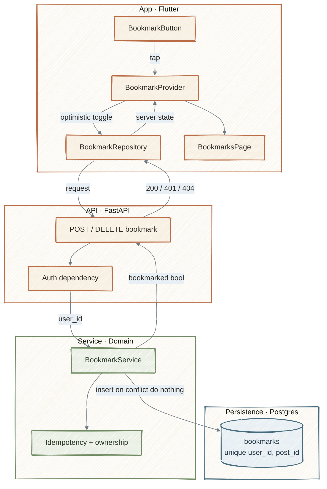

# Feature Blueprint: 收藏文章

登录用户在文章详情页收藏/取消收藏，个人页查看收藏列表。收藏状态同步返回；
`(user_id, post_id)` 唯一约束保证幂等；未登录 401，文章不存在 404。不做收藏夹
分组、公开收藏、计数排行和离线缓存。

```mermaid
%%{init: {"theme":"base","look":"handDrawn","themeVariables":{"background":"#FBF8F2","primaryColor":"#F7F0E3","primaryTextColor":"#2D2A26","primaryBorderColor":"#B86B45","lineColor":"#6F7C86","secondaryColor":"#E8F0F5","tertiaryColor":"#EDE9F7","fontFamily":"ui-rounded, Trebuchet MS, sans-serif"}}}%%
flowchart TB
    subgraph Client["App · Flutter"]
        Button["BookmarkButton"]
        Provider["BookmarkProvider"]
        Repo["BookmarkRepository"]
        Page["BookmarksPage"]
    end

    subgraph Edge["API · FastAPI"]
        Route["POST / DELETE bookmark"]
        Auth["Auth dependency"]
    end

    subgraph Core["Service · Domain"]
        Svc["BookmarkService"]
        Rules["Idempotency + ownership"]
    end

    subgraph Data["Persistence · Postgres"]
        Table[("bookmarks<br/>unique user_id, post_id")]
    end

    Button -->|"tap"| Provider
    Provider -->|"optimistic toggle"| Repo
    Repo -->|"request"| Route
    Route --> Auth
    Auth -->|"user_id"| Svc
    Svc --> Rules
    Svc -->|"insert on conflict do nothing"| Table
    Svc -->|"bookmarked bool"| Route
    Route -->|"200 / 401 / 404"| Repo
    Repo -->|"server state"| Provider
    Provider --> Page

    classDef warm fill:#F7F0E3,stroke:#B86B45,stroke-width:1.7px,color:#2D2A26
    classDef blue fill:#E8F0F5,stroke:#456A7C,stroke-width:1.7px,color:#243746
    classDef sage fill:#EAF0E5,stroke:#6F8A62,stroke-width:1.7px,color:#2C3828
    class Button,Provider,Repo,Page,Route,Auth warm
    class Svc,Rules sage
    class Table blue
    style Client fill:#FBF8F2,stroke:#B86B45,stroke-width:1.5px
    style Edge fill:#FBF8F2,stroke:#B86B45,stroke-width:1.5px
    style Core fill:#FBF8F2,stroke:#6F8A62,stroke-width:1.5px
    style Data fill:#FBF8F2,stroke:#456A7C,stroke-width:1.5px
```

纯确定性业务，不引入 AI 和异步任务；收藏失败只回滚按钮态，不影响阅读。
